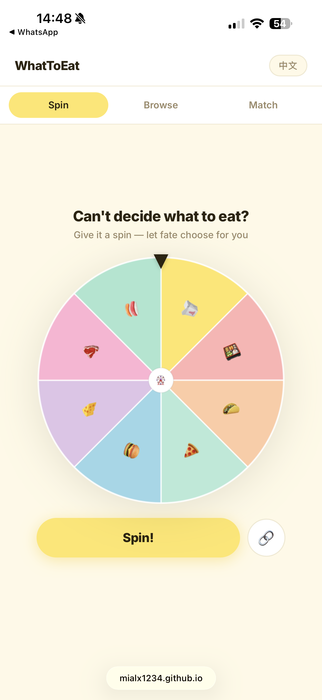
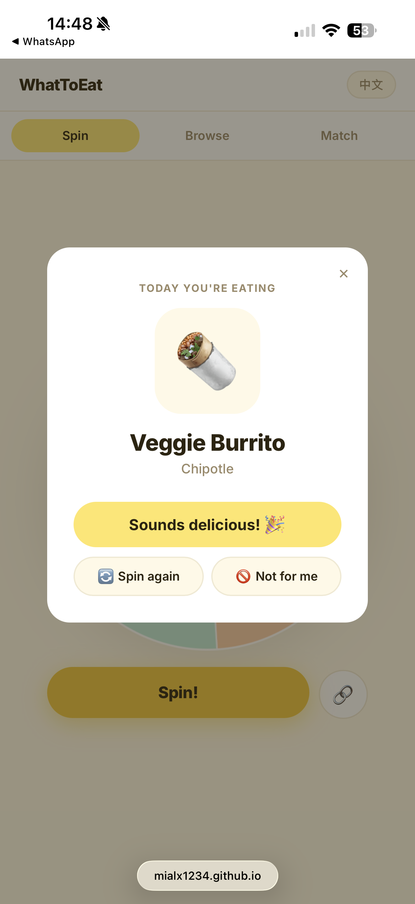
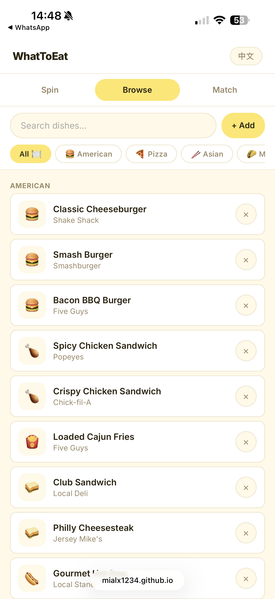
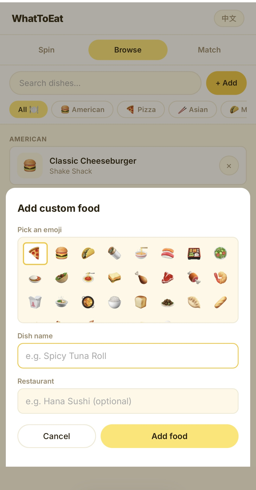
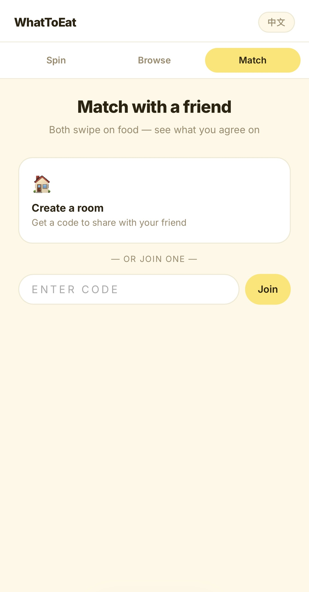
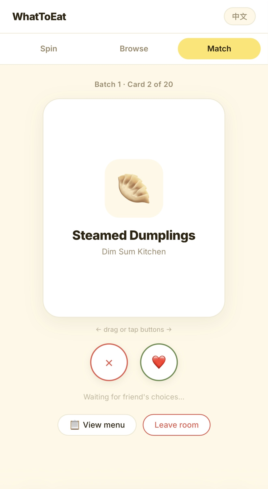

# 🍽️ WhatToEat

A fun, mobile-first food decision app. Can't decide what to eat? Spin the wheel, browse 100+ dishes, or match with a friend.

**Live app → [mialx1234.github.io/WhatToEat](https://mialx1234.github.io/WhatToEat/)**

---

## Features

- **Spin** — random wheel picks a dish for you
- **Browse** — 100+ curated dishes across 10 cuisines; block anything you don't want
- **Add** — add your own custom dishes to the wheel
- **Match** — real-time room with a friend; both swipe, see what you agree on
- **Tutorial** — 8-step guided tour on first visit (or tap "Tutorial ✦" anytime)
- **Chinese / English** — toggle with one tap

---

## How to Use

### 1 · Spin the Wheel

Open the app and tap **Spin!** The wheel picks a random dish from your personal menu.



When it lands, you'll see the result. Tap **Sounds delicious! 🎉** to accept, **Spin again** to re-roll, or **Not for me** to block that dish permanently.



---

### 2 · Browse & Block

Tap the **Browse** tab to see all dishes grouped by cuisine. Use the category pills to filter (American, Pizza, Asian, Mexican, and more — plus your own **✨ My Adds** and **🚫 Blocked** lists right at the front).



Tap **✕** next to any dish to block it — it's removed from the wheel immediately. Tap the **🚫 Blocked** pill to review and unblock anything.

---

### 3 · Add Your Own Food

Tap **+ Add** in the Browse tab to add a custom dish. Pick an emoji, name it, and optionally add a restaurant. It goes straight onto the wheel.



Your custom dishes appear under **✨ My Adds**.

---

### 4 · Match with a Friend

Tap the **Match** tab. One person creates a room and shares the 6-letter code; the other enters it to join.



Once both players are in, you'll each swipe through dishes independently — ❤️ for yes, ✕ for no. When you both like the same dish, you get a **It's a Match!** 🎉 screen showing what you both want.



The shared menu includes foods added by both players and automatically excludes dishes blocked by either person.

---

### 5 · Tutorial

On your first visit, an 8-step guided tour walks you through every feature — each card appears right next to the thing it's explaining, with a spotlight on the relevant UI element.

You can skip at any time. To replay the tutorial later, tap **Tutorial ✦** (below the language toggle in the top-right corner).

---

## Tech Stack

| Layer | What |
|---|---|
| Frontend | Vanilla HTML / CSS / JavaScript (single-page app) |
| Wheel | HTML5 Canvas |
| Real-time Match | Firebase Realtime Database |
| Hosting | GitHub Pages |
| Languages | English & Chinese (中文) |

---

## Files

```
index.html   — app shell, all views
style.css    — design system (baby yellow palette, components)
app.js       — all logic: spin, browse, match, tutorial
```

---

## Run Locally

No build step needed — just open `index.html` in a browser, or serve the folder:

```bash
python3 -m http.server 8080
# then open http://localhost:8080
```

---

## Deploy

The app auto-deploys to GitHub Pages from the `main` branch. Push any changes to `main` and the live site updates within ~60 seconds.

```bash
git add .
git commit -m "your message"
git push
```
